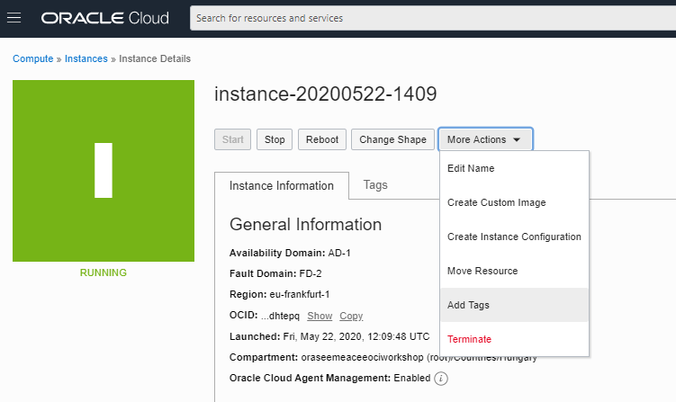
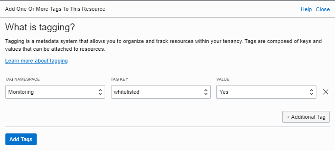
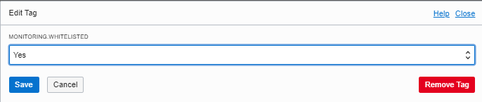
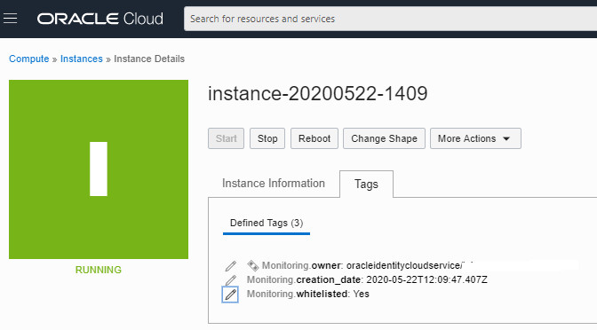
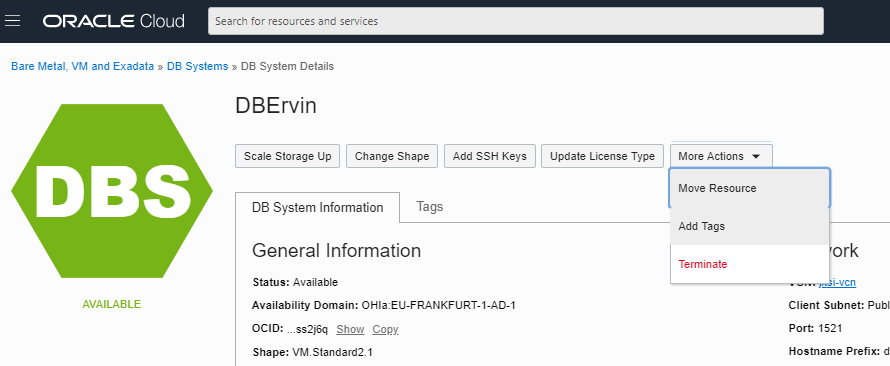
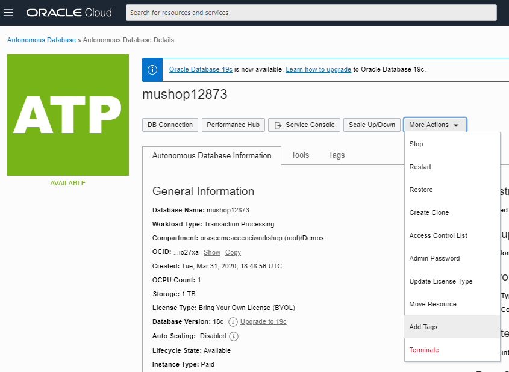

# How to configure the instance not to stop at night

If you have an instance that you do not want to stop at night, you can exclude it from stopping by tagging it according to the instructions in this document.

The stop script runs every night based on your cron job. If you want to exclude an instance from stop, you can set the whitelist tag so that the instance will not stop at night. It can be returned to the target of night stop again by deleting the tag or setting the value to other than yes.

### Instance to be stopped overnight
- Compute instance
- Database system
- ATP and ADW instances

## Tag setting method for each instance

### Compute instance

1. From the OCI console, open the instance details screen

2. Click on the **Add Tag** item within **More Actions**

    

3. Enter the following information and press the blue **Add Tags** button
    - **Tag Namespace** : Select *Monitoring*
    - **Tag Key** : Select *whitelisted*
    - **Value** : Select *Yes*

    
    
    If the whitelisted tag as already set by Tag Defaults, you just need to update it starting from the **Tags** tab of the instance details page.
    
    

4. Confirm that the set tag information is displayed in the **Tags** tab of the instance details screen.

    

5. This completes the settings

### Database system

1. Open the database system details screen from the OCI console

2. Click on the **Add Tag** item within **More Actions**

    

3. Enter the following information and press the blue **Apply Tag** button
    - **Tag Namespace** : Select *Monitoring*
    - **Tag Key** : Select *whitelisted*
    - **Value** : Select *Yes*
    

4. Confirm that the set tag information is displayed in the **Tag** tab of the instance details screen.

5. This completes the settings

### ATP and ADW instances

1. From the OCI console, open the ATP or ADW instance details screen

2. Click on the **Add Tag** item within **More Actions**

    

3. Enter the following information and press the blue **Apply Tag** button
    - **Tag Namespace** : Select *Monitoring*
    - **Tag Key** : Select *whitelisted*
    - **Value** : Select *Yes*
    
    

4. Confirm that the set tag information is displayed in the **Tag** tab of the instance details screen.

5. This completes the settings
